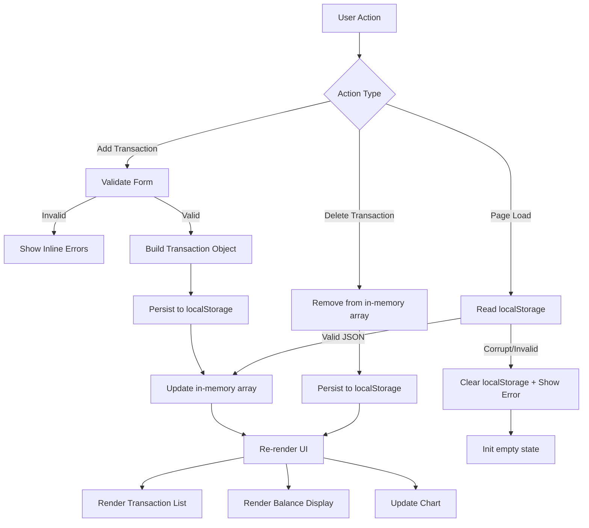

# Design Document: Expense & Budget Visualizer

## Overview

The Expense & Budget Visualizer is a fully client-side single-page application (SPA) with no backend, no build step, and no framework dependencies. Users add expense transactions (name, amount, category), view a running balance total, and see a live pie chart of spending by category. All data is stored in the browser's `localStorage`.

The entire application lives in three files:
- `index.html` — structure and CDN imports
- `css/style.css` — all visual styling
- `js/app.js` — all application logic

**Key design decisions:**
- A single in-memory `transactions` array is the single source of truth at runtime; all UI renders from it.
- Every mutation (add, delete) writes to `localStorage` first, then re-renders the UI — ensuring storage is never behind the display.
- Chart.js is loaded via CDN and a single `Chart` instance is reused (updated via `.data` mutation + `.update()`) to avoid canvas flicker.
- Validation is handled inline on form submit, producing per-field error messages without a page reload.

---

## Architecture

The app follows a simple **data → render** unidirectional flow with no reactive framework:



**Layers:**

| Layer | Location | Responsibility |
|---|---|---|
| HTML Structure | `index.html` | Semantic layout, CDN links, static skeleton |
| Styles | `css/style.css` | Layout, typography, colors via CSS custom properties |
| Application Logic | `js/app.js` | State, validation, DOM manipulation, Chart.js, localStorage |

There is no routing, no event bus, and no module system — functions are defined at the top of `app.js` and wired to DOM events via `addEventListener`.

---

## Components and Interfaces

All components are plain HTML elements manipulated via the DOM API. Below are the logical components and the JavaScript functions that drive them.

### 1. Input Form

**HTML element:** `<form id="transaction-form">`

**Fields:**
| Field | Element | Constraints |
|---|---|---|
| Name | `<input type="text" id="name-input">` | 1–100 non-whitespace characters |
| Amount | `<input type="number" id="amount-input">` | 0.01–999,999,999.99, ≤2 decimal places |
| Category | `<select id="category-select">` | One of: Food, Transport, Fun |

**JS functions:**
- `validateForm()` → `{ valid: boolean, errors: { name?, amount? } }` — pure validation, no side effects
- `handleFormSubmit(event)` — `submit` event handler: calls `validateForm`, shows/clears errors, calls `addTransaction` on success
- `resetForm()` — clears all fields and removes error messages
- `showFieldError(fieldId, message)` — injects an error `<span>` beneath the field
- `clearFieldErrors()` — removes all error spans

### 2. Transaction List

**HTML element:** `<ul id="transaction-list">`

**JS functions:**
- `renderTransactionList()` — clears the `<ul>` and re-renders all transactions from the in-memory array; shows placeholder if empty
- `createTransactionElement(transaction, index)` → `<li>` — builds a single row with name, amount, category, and a delete button
- `handleDeleteClick(index)` — `click` event handler on delete buttons (delegated to the `<ul>`): calls `deleteTransaction(index)`

### 3. Balance Display

**HTML element:** `<span id="balance-amount">` inside a header section

**JS functions:**
- `renderBalance()` — computes sum of all `transaction.amount` values and updates `textContent` formatted as `$0.00`

### 4. Chart

**HTML element:** `<canvas id="expense-chart">`

**JS functions:**
- `initChart()` — creates the `Chart` instance with `type: 'pie'`, called once on page load
- `updateChart()` — recomputes category totals from the in-memory array and mutates the existing chart's `data.labels`, `data.datasets[0].data`, then calls `chart.update()`

**Chart.js configuration:**
```js
{
  type: 'pie',
  data: {
    labels: [],          // populated dynamically: only categories with amount > 0
    datasets: [{
      data: [],
      backgroundColor: ['#FF6384', '#36A2EB', '#FFCE56'] // Food, Transport, Fun
    }]
  },
  options: {
    responsive: true,
    plugins: {
      legend: { position: 'bottom' }
    }
  }
}
```

### 5. Storage Module (functions within `app.js`)

- `loadFromStorage()` → `Transaction[]` — reads `localStorage`, parses JSON, validates schema; throws on corrupt data
- `saveToStorage(transactions)` — serializes and writes the full array; catches `QuotaExceededError` and calls `showStorageError()`
- `clearStorage()` — removes the key from `localStorage`

### 6. Error Display

- `showStorageError()` — renders a visible dismissible banner for storage write failures
- `showCorruptDataError()` — renders a visible banner when corrupt data is detected and cleared on load

---

## Data Models

### Transaction Object (runtime + localStorage)

```ts
interface Transaction {
  name:     string;    // 1–100 non-whitespace chars
  amount:   number;    // 0.01–999,999,999.99, max 2 decimal places
  category: 'Food' | 'Transport' | 'Fun';
}
```

Stored as a JSON array under the key `"transactions"` in `localStorage`:

```json
[
  { "name": "Coffee", "amount": 4.50, "category": "Food" },
  { "name": "Bus pass", "amount": 30.00, "category": "Transport" }
]
```

No `id` field is needed — array index serves as the delete key at runtime. Since there is no server sync, a stable UUID is not required.

### Validation Rules

| Field | Rule |
|---|---|
| name | `typeof string`, trimmed length ≥ 1 and ≤ 100 |
| amount | `isFinite`, ≥ 0.01, ≤ 999999999.99, decimal places ≤ 2 |
| category | one of `['Food', 'Transport', 'Fun']` |

### Corrupt Data Detection (on load)

The loaded value must satisfy all of the following:
1. `JSON.parse()` succeeds
2. Result is an `Array`
3. Every element has `name` (string), `amount` (finite number), and `category` (valid enum value)

If any check fails → clear `localStorage` key + show error banner + init empty state.

### In-Memory State

```js
let transactions = [];   // single source of truth
let chart = null;        // Chart.js instance reference
```

No other global state. All derived values (balance, chart data) are computed on demand from `transactions`.

---

## Correctness Properties

*A property is a characteristic or behavior that should hold true across all valid executions of a system — essentially, a formal statement about what the system should do. Properties serve as the bridge between human-readable specifications and machine-verifiable correctness guarantees.*


### Property 1: Name validation rejects whitespace and out-of-range inputs

*For any* string provided as the transaction name, `validateForm()` SHALL return invalid with a name error if and only if the string — after trimming — has length 0 or greater than 100.

**Validates: Requirements 1.1, 1.5**

### Property 2: Amount validation rejects invalid numeric inputs

*For any* value provided as the transaction amount, `validateForm()` SHALL return invalid with an amount error if and only if the value is non-numeric, less than 0.01, greater than 999,999,999.99, or has more than 2 decimal places.

**Validates: Requirements 1.1, 1.6**

### Property 3: Add transaction round-trip

*For any* valid transaction (name, amount, category), after `addTransaction()` is called: (a) the in-memory `transactions` array SHALL contain an entry equal to that transaction, and (b) reading `localStorage` and parsing it SHALL yield an array that includes that transaction.

**Validates: Requirements 1.2, 1.3**

### Property 4: Transaction list renders every entry correctly

*For any* array of transactions, `renderTransactionList()` SHALL produce a list element containing one row per transaction, where each row includes the transaction's name, amount formatted to exactly two decimal places, and category label.

**Validates: Requirements 2.2**

### Property 5: Delete integrity — removes exactly one, preserves all others

*For any* transactions array of length n ≥ 1 and any valid index i, after `deleteTransaction(i)`: the in-memory array SHALL have length n−1, SHALL NOT contain the transaction that was at index i, and SHALL contain all other transactions in their original relative order. The `localStorage` value SHALL reflect the same reduced array.

**Validates: Requirements 2.6, 2.7**

### Property 6: Storage round-trip preserves data

*For any* valid array of transaction objects, serializing it with `saveToStorage()` and then deserializing it with `loadFromStorage()` SHALL return an array deeply equal to the original.

**Validates: Requirements 2.4, 5.3**

### Property 7: Balance equals sum of all transaction amounts

*For any* array of transactions (including the empty array), `computeBalance()` SHALL return the exact arithmetic sum of all `amount` values, formatted as a string `"$X.XX"` with exactly two decimal places (returning `"$0.00"` for the empty array).

**Validates: Requirements 3.1, 3.4**

### Property 8: Chart data is proportional to category sums

*For any* non-empty array of transactions, `computeChartData()` SHALL return labels and data arrays where each label is a category with nonzero spending and the corresponding data value equals the sum of all amounts for that category. Only categories present in the array with amount > 0 SHALL appear in the output.

**Validates: Requirements 4.1, 4.5**

### Property 9: Corrupt storage data is discarded gracefully

*For any* value stored in `localStorage` that is not a valid JSON array of transaction objects (malformed JSON, not an array, entries with missing or wrong-typed fields), `loadFromStorage()` SHALL signal an error, the app SHALL clear the corrupted key, and all three components (Transaction_List, Balance_Display, Chart) SHALL be initialised to their empty/zero states.

**Validates: Requirements 5.4**

---

## Error Handling

### Form Validation Errors

- Triggered on form `submit` event before any state mutation.
- `showFieldError(fieldId, message)` inserts a `<span class="error-msg">` immediately after the relevant input.
- `clearFieldErrors()` removes all `.error-msg` elements before each validation pass.
- Validation is re-run on every submit attempt; errors are not shown live on keystroke.

### Storage Write Failure (QuotaExceededError)

- `saveToStorage()` wraps `localStorage.setItem()` in a `try/catch`.
- On `QuotaExceededError` (or any write exception), the in-memory state is NOT rolled back — the transaction is still shown for the current session.
- `showStorageError()` renders a dismissible `<div role="alert" class="banner banner--error">` at the top of the page with the message: *"Could not save data — storage quota exceeded."*
- The banner has a close button (`×`); clicking it removes the element from the DOM.

### Corrupt Data on Load

- `loadFromStorage()` is called once in `DOMContentLoaded`.
- On any parse/validation failure, the function calls `clearStorage()` and returns `[]`.
- The caller (`initApp()`) detects the error signal and calls `showCorruptDataError()`, which renders a banner: *"Saved data was corrupted and has been cleared."*
- All three components are then initialised with the empty array.

### Missing / No Data on Load

- If `localStorage.getItem('transactions')` returns `null` (first visit or cleared storage), `loadFromStorage()` returns `[]` without error — this is the normal empty-state init path.

---

## Testing Strategy

### Assessment: Is Property-Based Testing Appropriate?

This feature is a client-side web application with DOM manipulation, CSS styling, Chart.js rendering, and localStorage I/O. The bulk of the feature is UI wiring and side-effect orchestration. However, several pure functions exist within `app.js` that have clear input → output behavior and are excellent candidates for property-based testing:

- `validateForm()` / `validateName()` / `validateAmount()` — pure validation logic
- `computeBalance()` — pure arithmetic
- `computeChartData()` — pure data transformation
- `loadFromStorage()` / `saveToStorage()` — storage round-trip logic (testable with mocked localStorage)

PBT is NOT used for:
- DOM rendering (renderTransactionList, renderBalance) — use snapshot/example tests
- Chart.js canvas rendering — use example tests + mock
- CSS layout and visual hierarchy — manual / smoke tests
- Timing requirements (3 seconds load, 100ms interaction) — manual / Lighthouse

**PBT library choice:** [fast-check](https://github.com/dubzzz/fast-check) (JavaScript, browser-compatible, no build step required in test environment).

---

### Unit & Property Tests

| Test | Type | Requirement(s) |
|---|---|---|
| Name validator accepts 1–100 non-whitespace chars | PROPERTY | 1.1, 1.5 |
| Name validator rejects whitespace-only / empty strings | PROPERTY | 1.5 |
| Name validator rejects strings trimmed length > 100 | PROPERTY | 1.1 |
| Amount validator accepts values in [0.01, 999999999.99] with ≤2 decimals | PROPERTY | 1.1 |
| Amount validator rejects out-of-range and bad-format values | PROPERTY | 1.1, 1.6 |
| addTransaction adds entry to in-memory array | PROPERTY | 1.2 |
| saveToStorage + loadFromStorage round-trip | PROPERTY | 2.4, 5.3 |
| deleteTransaction removes exactly one entry at index i | PROPERTY | 2.6, 2.7 |
| computeBalance returns correct sum formatted as "$X.XX" | PROPERTY | 3.1, 3.4 |
| computeChartData returns proportional values for non-empty input | PROPERTY | 4.1 |
| computeChartData omits categories with zero spending | PROPERTY | 4.5 |
| loadFromStorage returns empty array for null localStorage | EXAMPLE | 5.3 |
| loadFromStorage returns error + empty array for corrupt data | PROPERTY | 5.4 |
| renderTransactionList shows placeholder when array is empty | EXAMPLE | 2.1 |
| resetForm clears all fields after successful submission | EXAMPLE | 1.4 |
| showStorageError is called when setItem throws QuotaExceededError | EXAMPLE | 5.5 |

### Property Test Configuration

- Each property-based test runs a minimum of **100 iterations**.
- Each test is tagged with a comment in the format:

  ```js
  // Feature: expense-budget-visualizer, Property 1: Name validation rejects whitespace and out-of-range inputs
  ```

### Integration / Smoke Tests

| Test | Type |
|---|---|
| App loads and all input fields are enabled with no loading indicator | SMOKE |
| Transaction list has CSS `overflow-y: auto/scroll` on the container | SMOKE |
| Chart.js (not another library) is instantiated on the canvas element | SMOKE |
| App renders without horizontal scroll at 320px viewport width | SMOKE |
| Font size is ≥ 16px at default browser zoom | SMOKE |

### Manual Testing Checklist

- [ ] Add transaction → appears in list, balance updates, chart updates
- [ ] Delete transaction → removed from list, balance updates, chart updates
- [ ] Submit empty form → error messages shown for empty fields
- [ ] Submit form with invalid amount → error message on amount field
- [ ] Reload page → transactions, balance, and chart restored from localStorage
- [ ] Corrupt localStorage manually → error banner shown, empty state displayed
- [ ] Test in Chrome, Firefox, Edge, and Safari (current stable)
- [ ] Resize to 320px viewport — no horizontal scroll
- [ ] Performance: page becomes interactive in < 3 seconds on 25 Mbps
